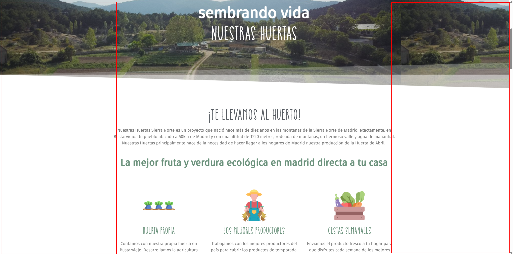
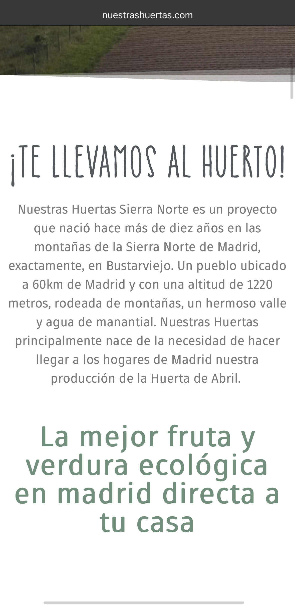
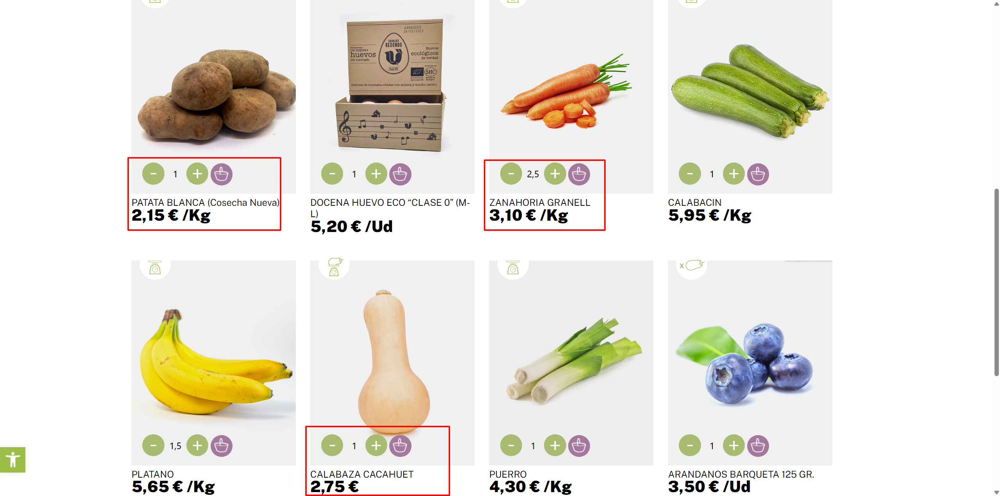
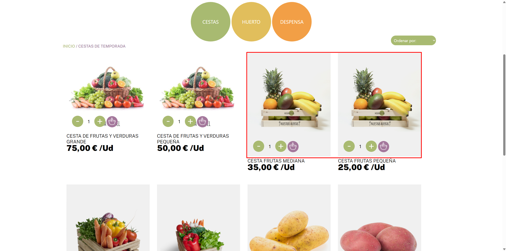
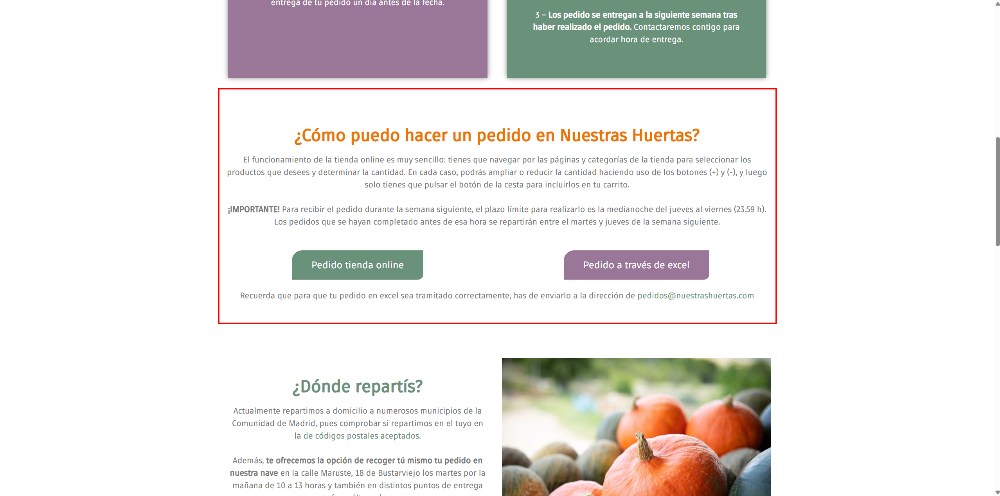

# Capturas del análisis — Huerta Madrid (nuestrashuertas.com)

> Pruebas visuales de los problemas identificados en el análisis UX  
> Cada captura referencia un problema concreto del análisis realizado

---

## Captura 01 — Home en escritorio: márgenes vacíos laterales

**Problema:** La página home en escritorio utiliza un layout de ancho fijo que deja grandes márgenes vacíos a ambos lados del contenido. El resultado es una sensación de que falta contenido o de que la página está a medio hacer. Viola la heurística 8 (estética y diseño minimalista) al desperdiciar espacio útil de pantalla.

→ Referenciado en: [Análisis heurístico — Heurística 8](../README.md)

---

## Captura 02 — Home en móvil: falta de márgenes laterales

**Problema:** En móvil el efecto es el contrario: el contenido colapsa hasta los bordes de la pantalla sin dejar margen lateral para respirar. La lectura resulta incómoda y la sensación general es de agobio. Es el resultado directo de un diseño de ancho fijo que no se adapta bien a ninguno de los dos extremos.

→ Referenciado en: [Análisis responsive](../README.md)

---

## Captura 03 — Error 404 en el flujo de compra por Excel

**Problema:** Al intentar acceder al proceso de compra por Excel, la web devuelve un error de página no encontrada (404). Es el problema más crítico del sitio: bloquea completamente una de las dos vías de compra disponibles sin ofrecer ninguna alternativa ni mensaje de ayuda. Viola las heurísticas 5 (prevención de errores) y 9 (ayuda a reconocer y recuperarse de errores).

→ Referenciado en: [Análisis heurístico — Heurísticas 5 y 9](../README.md)

---

## Captura 04 — Tienda online: unidades de producto poco claras

**Problema:** En la tienda online, al visualizar los productos no queda claro qué se está comprando exactamente: ¿una pieza? ¿un kilo? ¿una bolsa? Esta confusión es especialmente grave en una tienda de alimentación, donde el usuario necesita saber exactamente qué cantidad está comprando antes de añadir al carrito. Viola las heurísticas 2 (coincidencia con el mundo real) y 6 (reconocimiento antes que recuerdo).

→ Referenciado en: [Análisis heurístico — Heurísticas 2 y 6](../README.md)

---

## Captura 05 — Cajas de fruta de temporada: misma foto para distintos tamaños

**Problema:** Las cajas de fruta de temporada disponibles en distintos tamaños comparten exactamente la misma imagen de producto. El usuario no puede distinguir visualmente entre las opciones y pierde confianza en lo que está comprando. Viola la heurística 4 (consistencia y estándares) y refuerza la sensación de confusión en el proceso de compra.

→ Referenciado en: [Análisis heurístico — Heurística 4](../README.md)

---

## Captura 06 — Página "Cómo comprar": proceso por Excel explicado

**Problema:** La página de ayuda explica el proceso de compra por Excel con detalle, pero el propio proceso descrito (recibir un Excel por email, rellenarlo y reenviarlo) está completamente fuera de lo normal dentro del comercio electrónico. Para un usuario que espera añadir productos al carrito y pagar online, este flujo resulta incomprensible. Viola la heurística 10 (ayuda y documentación) porque la documentación describe un proceso confuso en lugar de encontrar una solución más sencilla.

→ Referenciado en: [Análisis heurístico — Heurística 10](../README.md)

---

*Alejandro Gea Martínez · DIU · Curso 2025/26 · Universidad de Granada, ETSIIT*
