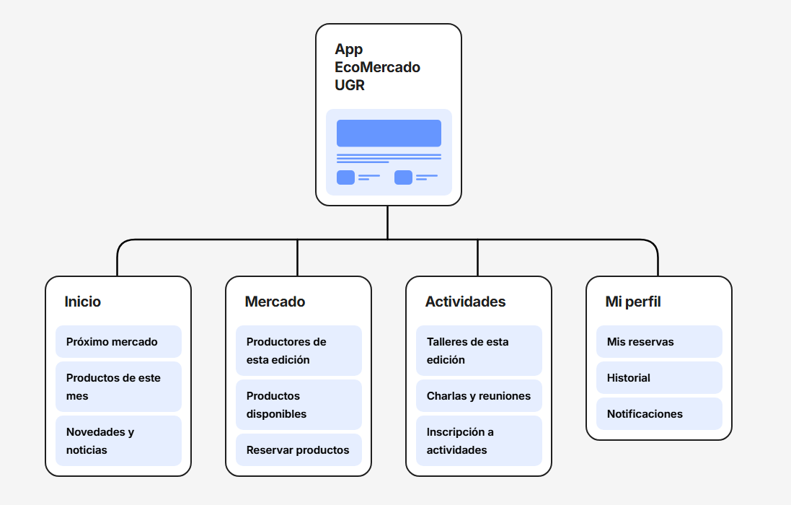
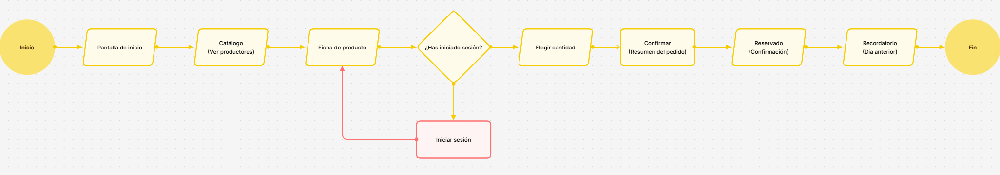
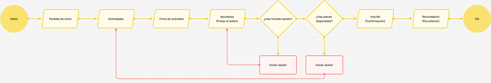

# Arquitectura de información — App EcoMercado UGR

> Sitemap y user flows de la app  
> Herramientas de diseño centrado en usuario aplicadas al caso EcoMercado UGR 

---

## Sitemap

**Descripción:** Mapa de estructura completo de la app. Fácil acceso directo a las cuatro secciones principales: Inicio, Mercado, Actividades y Mi perfil. El acceso a Iniciar sesión / Registro está conectado desde cualquier punto del flujo que requiera identificación del usuario como las reservas de productos o inscripciones a actividades.

La estructura es sencilla y plana. No más de dos niveles de profundidad en ninguna sección para que cualquiera pueda orientarse desde la primera vez que abre la app sin necesidad de explorar.

→ Referenciado en: [Propuesta de diseño — Arquitectura de información](../README.md)

---

## User flow 01 — Reservar un producto

**Descripción:** Flujo principal de la app. El usuario accede desde la pantalla de inicio, navega al catálogo, selecciona un producto y pulsa reservar. En ese momento se comprueba si está logueado: si lo está, continúa directamente a elegir cantidad y confirmar; si no, se le redirige al registro rápido y vuelve al flujo principal. La reserva confirmada genera automáticamente un recordatorio para el día anterior al mercado.

Cada paso tiene una sola acción posible. No hay bifurcaciones confusas ni decisiones técnicas que el usuario no sepa tomar.

→ Referenciado en: [Propuesta de diseño — User Flow principal](../README.md)

---

## User flow 02 — Inscribirse a una actividad

**Descripción:** Flujo secundario para inscribirse a talleres y charlas. El usuario accede desde la sección de Actividades, consulta la ficha de la actividad y pulsa apuntarse. Si no está logueado, se le redirige al registro igual que en el flujo anterior. Una vez identificado, el sistema comprueba si quedan plazas disponibles: si las hay, la inscripción se confirma; si no, el usuario vuelve a la lista de actividades. Si logra obtener plaza, recibe un recordatorio el día anterior.

La decisión de plazas disponibles es un añadido para que sea más realista, los talleres del EcoMercado tienen aforo limitado, y así mejora la experiencia frente a un simple botón de inscripción sin control de capacidad.

→ Referenciado en: [Propuesta de diseño — Arquitectura de información](../README.md)

---

*Alejandro Gea Martínez · DIU · Curso 2025/26 · Universidad de Granada, ETSIIT*
