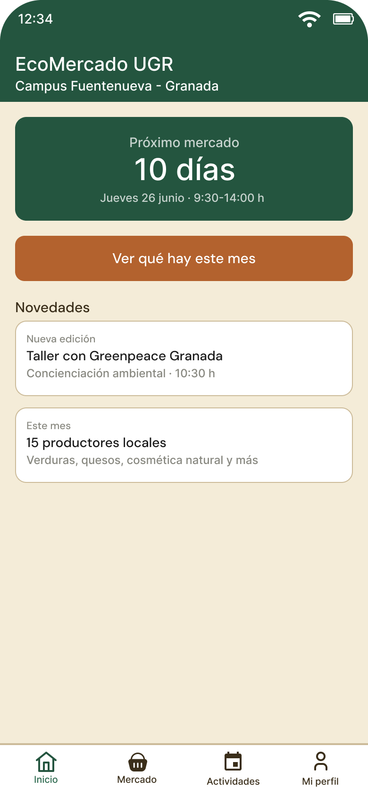
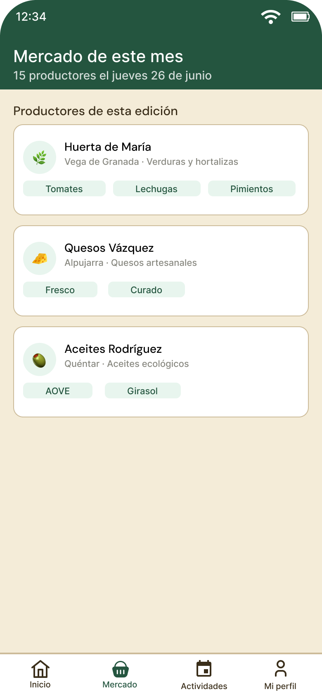
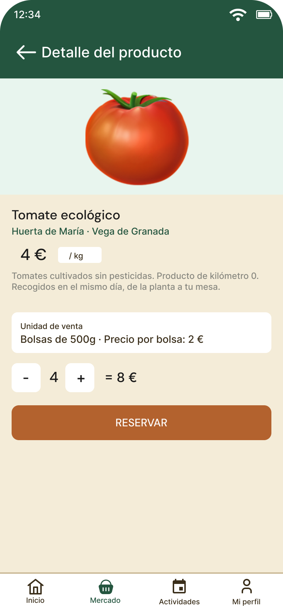
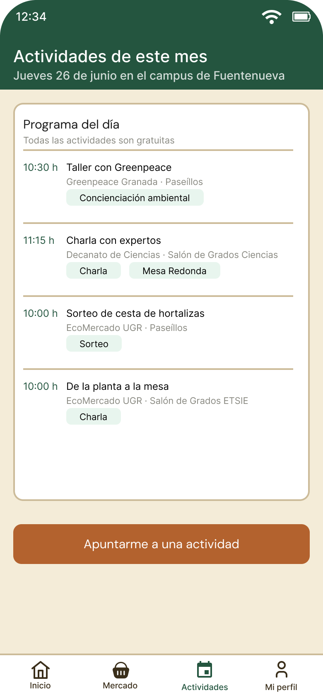
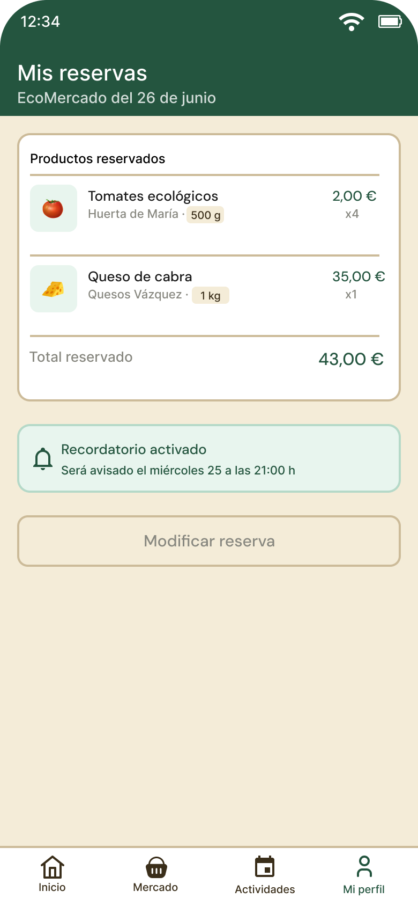

# Wireframes — App EcoMercado UGR

> Bocetos de alta fidelidad de las pantallas principales de la app  
> Diseñados en Figma siguiendo los principios de diseño mobile-first 

---

## Pantallas incluidas

### Pantalla 01 — Inicio

**Descripción:**  Lo primero que ve el usuario es la respuesta a la pregunta más urgente: ¿cuándo es el próximo mercado? Un contador grande en la parte superior, con la fecha, hora y lugar del próximo mercado bien visibles. Debajo, un acceso directo al catálogo de esta edición. Para Laura, es suficiente para planificar. Para Marcos, es suficiente para saber si puede ir.

---

### Pantalla 02 — Catálogo de productores

**Descripción:** Lista de productores con foto, nombre y una línea de descripción de qué traen. Al pulsar en uno se abre su ficha completa: quién es, de dónde viene y qué productos trae. El objetivo es que el usuario conozca a las personas detrás de los productos; algo que diferencia al EcoMercado de cualquier supermercado y que en este diseño puede funcionar al buscar ese acercamiento del campo a la mesa.

---

### Pantalla 03 — Ficha de producto

**Descripción:** Aquí está uno de los aprendizajes directos del análisis de Nuestras Huertas: la ambigüedad sobre qué se está comprando es un problema importante. En esta app, cada producto muestra de forma clara y explícita la foto real del producto, el nombre, el productor, la unidad de venta (ej. "bolsa de 500g", "docena de huevos", "1 kg"), el precio y la disponibilidad. Sin lugar a confusión.

---

### Pantalla 04 — Actividades

**Descripción:** Los talleres y charlas son una parte importante del EcoMercado que en la mayoría de webs de referencia queda en segundo plano. Aquí tienen su propia sección, con hora, descripción breve y opción de apuntarse. Para Laura es un valor añadido; para Marcos puede ser la razón por la que decida ir.

---

### Pantalla 05 — Mis reservas

**Descripción:** Resumen claro de lo que el usuario ha reservado para el próximo mercado. Puede modificar o cancelar antes del día del mercado. El día anterior llega una notificación de recordatorio con el resumen del pedido. Simple, sin sorpresas.

---

## Decisiones de diseño

| Elemento | Decisión | Justificación |
|---|---|---|
| Color principal | Verde oscuro `#2D6A4F` | Naturaleza y sostenibilidad sin parecer clínico |
| Color de fondo | Beige cálido `#F4ECD8` | Recuerda a lo artesanal y orgánico |
| Color de acción | Naranja tierra `#E07B39` | Llama la atención sin ser agresivo |
| Colores secundarios | Marrón tierra `#3A2E1A` | Verde menta pastel `#E8F5EE` |
| Tipografía títulos | DM Sans | Cercana y legible en móvil |
| Tipografía cuerpo | Inter | Muy legible en tamaños pequeños |
| Áreas táctiles | Tamaño suficientes | Cumple WCAG 2.1 |
| Contraste de texto | Buen uso en todos los textos | Cumple WCAG 2.1 nivel AA |

---

*Alejandro Gea Martínez · DIU · Curso 2025/26 · Universidad de Granada, ETSIIT*
